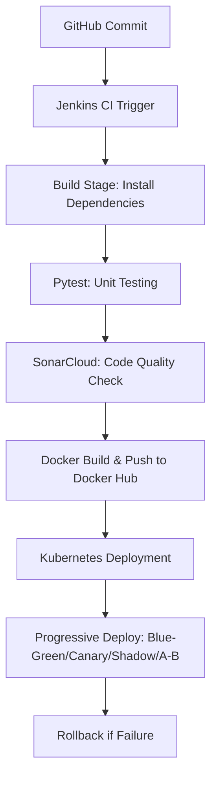

# ACEest Fitness & Gym — DevOps CI/CD Pipeline

## Project Overview
**ACEest Fitness & Gym** is a complete **DevOps CI/CD pipeline implementation** for a Flask-based fitness management system.  
It automates the end-to-end software delivery process—covering **code integration, testing, code quality validation, containerization, and deployment**—using modern DevOps tools.  

The solution demonstrates **progressive deployment strategies** such as **Blue-Green**, **Canary**, **Shadow**, and **A/B Testing** on Kubernetes, with an integrated **rollback mechanism** for reliability.  

---

## Objectives
- Design and implement a **complete CI/CD pipeline** using Jenkins, Docker, and Kubernetes.  
- Automate build, test, quality analysis, and deployment workflows.  
- Integrate **SonarCloud** for continuous code quality validation.  
- Demonstrate **zero-downtime** and **safe rollback** deployment strategies.  

---

## Tech Stack and Tools

| Category | Tool / Framework | Purpose |
|-----------|------------------|----------|
| Version Control | **Git & GitHub** | Source control and branching strategy |
| CI Automation | **Jenkins** | Pipeline orchestration and automation |
| Testing | **Pytest** | Automated unit testing |
| Code Quality | **SonarCloud** | Static analysis and quality gates |
| Containerization | **Docker** | Application packaging and isolation |
| Registry | **Docker Hub** | Container image storage and versioning |
| Orchestration | **Kubernetes / Minikube** | Automated container deployment |
| Deployment Strategies | **Blue-Green, Canary, Shadow, A/B Testing** | Progressive rollouts and safe updates |
| Rollback | **Kubernetes / Jenkins** | Restore stable version on failure |

---

## Project Structure

```
ACEest-Fitness-CICD/
│
├── app/                                # Application source code
│   ├── __init__.py
│   ├── ACEest_Fitness.py               # Main Flask application
│   ├── ACEest_Fitness-V1.1.py          # Version 1.1
│   ├── ACEest_Fitness-V1.2.1.py        # Version 1.2.1
│   ├── ACEest_Fitness-V1.2.2.py        # Version 1.2.2
│   ├── ACEest_Fitness-V1.2.3.py        # Version 1.2.3
│   ├── ACEest_Fitness-V1.3.py          # Version 1.3 (latest)
│   ├── web_app.py                      # Web routes and Flask logic
│
├── tests/                              # Test automation using Pytest
│   ├── test_fitness_app.py
│   ├── test_fitness_v11.py
│   ├── test_fitness_v12.py
│   ├── test_fitness_v121.py
│   ├── test_fitness_v122.py
│   ├── test_fitness_v123.py
│   ├── test_fitness_v13.py
│   ├── test_webapp.py
│   
│
├── k8s/                                # Kubernetes configuration
│   ├── ab/
│   │   ├── deployment-a.yaml           # A version deployment (A/B testing)
│   │   ├── deployment-b.yaml           # B version deployment
│   │   ├── service-a.yaml              # Service A
│   │   └── service-b.yaml              # Service B
│   ├── blue-deployment.yaml            # Blue environment
│   ├── green-deployment.yaml           # Green environment
│   ├── canary-deployment.yaml          # Canary rollout
│   ├── service-canary.yaml             # Canary routing
│   ├── shadow-deployment.yaml          # Shadow release
│   ├── shadow-service.yaml             # Shadow service
│   ├── ingress-shadow.yaml             # Shadow ingress configuration
│   ├── service.yaml                    # Base service definition
│   └── deployment.yaml                 # Base deployment definition
│
├
├── coverage.xml                        # Pytest coverage report
├── Dockerfile                          # Docker build definition
├── Jenkinsfile                         # Jenkins pipeline definition
├── push_all_versions.sh                # Script to push multiple versions
├── pytest.ini                          # Pytest configuration file
├── README.md                           # Documentation
├── requirements.txt                    # Python dependencies
├── sonar_issues.json                   # SonarCloud issue report
├── sonar_report.json                   # SonarCloud summary report
├── sonarcommands.txt                   # Sonar command references
└── versions/                           # Backup of all versioned scripts

```

---

## 🔗 Repository & Resources

- **GitHub Repository:** [https://github.com/srilakshmikalaga/ACEest-Fitness-CICD](https://github.com/srilakshmikalaga/ACEest-Fitness-CICD)  
- **Docker Hub Repository:** [https://hub.docker.com/repository/docker/srilakshmikalaga/aceest-fitness-app/](https://hub.docker.com/repository/docker/srilakshmikalaga/aceest-fitness-app/)  
- **SonarCloud Dashboard:** [https://sonarcloud.io/summary/overall?id=ACEest-Fitness-CICD&branch=master](https://sonarcloud.io/summary/overall?id=ACEest-Fitness-CICD&branch=master)

---

## Jenkins CI/CD Workflow



### Jenkinsfile Stages
| Stage | Description |
|--------|--------------|
| **Checkout** | Pulls latest code from GitHub |
| **Build** | Installs dependencies |
| **Test** | Executes Pytest tests |
| **Quality Analysis** | Runs SonarCloud scan |
| **Docker Build** | Builds and tags image |
| **Push Image** | Uploads to Docker Hub |
| **Deploy** | Applies Kubernetes manifests |
| **Rollback** | Reverts to last stable deployment if needed |

---

## Testing

Run tests locally:
```bash
pytest -q
```
- Validates Flask endpoints and logic.  
- Automatically executed during Jenkins pipeline runs.  

---

## Docker Setup

```bash
docker build -t srilakshmikalaga/aceest-fitness-app:latest .
docker run -d -p 5000:5000 srilakshmikalaga/aceest-fitness-app:latest
```
Push to Docker Hub:
```bash
docker push srilakshmikalaga/aceest-fitness-app:latest
```

---

## Kubernetes Deployment

Deploy the base application:
```bash
kubectl apply -f k8s/deployment.yaml
kubectl apply -f k8s/service.yaml
```
Check resources:
```bash
kubectl get pods
kubectl get svc
```

---

## Deployment Strategies

### 1. Blue-Green Deployment
Deploy two environments:
```bash
kubectl apply -f k8s/blue-deployment.yaml
kubectl apply -f k8s/green-deployment.yaml
```
Switch traffic:
```bash
kubectl patch service aceest-fitness-service -p '{"spec":{"selector":{"version":"green"}}}'
```
Rollback:
```bash
kubectl patch service aceest-fitness-service -p '{"spec":{"selector":{"version":"blue"}}}'
```

### 2. Canary Deployment
Release gradually to subset of users:
```bash
kubectl apply -f k8s/canary-deployment.yaml
kubectl apply -f k8s/service-canary.yaml
```

### 3. Shadow Deployment
Test new version using mirrored production traffic:
```bash
kubectl apply -f k8s/shadow-deployment.yaml
kubectl apply -f k8s/shadow-service.yaml
kubectl apply -f k8s/ingress-shadow.yaml
```

### 4. A/B Testing Deployment
Compare two versions simultaneously:
```bash
kubectl apply -f k8s/ab/deployment-a.yaml
kubectl apply -f k8s/ab/deployment-b.yaml
kubectl apply -f k8s/ab/service-a.yaml
kubectl apply -f k8s/ab/service-b.yaml
```

###  5. Rolling Update Deployment
Update pods incrementally:
```bash
kubectl apply -f k8s/deployment.yaml
kubectl rollout status deployment/aceest-fitness
```
Rollback:
```bash
kubectl rollout undo deployment/aceest-fitness
```

### Rollback (Jenkinsfile)
```groovy
post {
    failure {
        sh '''
        echo "Deployment failed! Rolling back..."
        kubectl rollout undo deployment/aceest-fitness
        kubectl patch service aceest-fitness-service -p '{"spec":{"selector":{"version":"blue"}}}'
        '''
    }
}
```

---

## SonarCloud Integration

SonarCloud has been successfully integrated within the Jenkins pipeline to ensure **continuous code quality and static analysis**.  
It automatically scans every commit for:  
- **Bugs, vulnerabilities, and code smells**  
- **Maintainability and reliability checks**  
- **Test coverage reports (from Pytest)**  
- **Duplication and complexity insights**  

>  *A quality gate ensures that only reliable and maintainable code is promoted to deployment.*  

**Project Dashboard:**  
[View SonarCloud Analysis](https://sonarcloud.io/summary/overall?id=ACEest-Fitness-CICD&branch=master)

---

## SonarCloud Quality Overview (Latest Analysis)

From the latest analysis on **SonarCloud (09 Nov 2025)**:  
- **Reliability:** A (10 minor issues)  
- **Maintainability:** A (86 issues resolved)  
- **Security:** A (0 vulnerabilities)  
- **Hotspots Reviewed:** 100%  
- **Coverage:** 83.1%  
- **Duplications:** 12.8%  
- **Quality Gate:** ✅ Passed  

This indicates a **high-quality, maintainable, and secure** codebase integrated into the CI/CD workflow.

---

## Command Summary

| Purpose | Command |
|----------|----------|
| Run tests | `pytest -q` |
| Build Docker image | `docker build -t aceest-fitness:latest .` |
| Run container | `docker run -d -p 5000:5000 aceest-fitness:latest` |
| Push to Docker Hub | `docker push srilakshmikalaga/aceest-fitness-app:latest` |
| Apply deployment | `kubectl apply -f k8s/deployment.yaml` |
| Blue-Green switch | `kubectl patch service aceest-fitness-service -p '{"spec":{"selector":{"version":"green"}}}'` |
| Canary rollout | `kubectl apply -f k8s/canary-deployment.yaml` |
| Shadow testing | `kubectl apply -f k8s/shadow-deployment.yaml` |
| A/B testing setup | `kubectl apply -f k8s/ab/deployment-a.yaml` |
| Rolling update check | `kubectl rollout status deployment/aceest-fitness` |
| Rollback | `kubectl rollout undo deployment/aceest-fitness` |

---

## Key Learnings

- Implemented a **multi-stage Jenkins pipeline**.  
- Automated **code quality checks** via SonarCloud.  
- Executed **five Kubernetes deployment strategies**.  
- Integrated **Pytest**, **Docker**, and **Kubernetes** into one workflow.  
- Gained real-world insight into **DevOps lifecycle automation**.  

---

## Author

K N S Srilakshmi 
