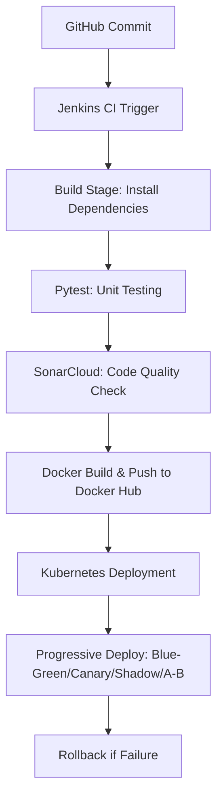

# ACEest Fitness & Gym — DevOps CI/CD Pipeline

## Project Overview
**ACEest Fitness & Gym** is a complete **DevOps CI/CD pipeline implementation** for a Flask-based fitness management system.  
It automates the end-to-end software delivery process—covering **code integration, testing, code quality validation, containerization, and deployment**—using modern DevOps tools.  

The solution demonstrates **progressive deployment strategies** such as **Blue-Green**, **Canary**, **Shadow**, and **A/B Testing** on Kubernetes, with an integrated **rollback mechanism** for reliability.  

---

## Objectives
- Design and implement a **complete CI/CD pipeline** using Jenkins, Docker, and Kubernetes.  
- Automate build, test, quality analysis, and deployment workflows.  
- Integrate **SonarCloud** for continuous code quality validation.  
- Demonstrate **zero-downtime** and **safe rollback** deployment strategies.  

---

## Tech Stack and Tools

| Category | Tool / Framework | Purpose |
|-----------|------------------|----------|
| Version Control | **Git & GitHub** | Source control and branching strategy |
| CI Automation | **Jenkins** | Pipeline orchestration and automation |
| Testing | **Pytest** | Automated unit testing |
| Code Quality | **SonarCloud** | Static analysis and quality gates |
| Containerization | **Docker** | Application packaging and isolation |
| Registry | **Docker Hub** | Container image storage and versioning |
| Orchestration | **Kubernetes / Minikube** | Automated container deployment |
| Deployment Strategies | **Blue-Green, Canary, Shadow, A/B Testing** | Progressive rollouts and safe updates |
| Rollback | **Kubernetes / Jenkins** | Restore stable version on failure |

---

## Project Structure

```
ACEest-Fitness-CICD/
│
├── ACEest_Fitness-V1.3.py             # Latest version of the Flask app
├── coverage.xml                       # Test coverage report (Pytest)
├── Dockerfile                         # Docker build definition
├── Jenkinsfile                        # Jenkins CI/CD pipeline definition
├── pytest.ini                         # Pytest configuration
├── README.md                          # Project documentation
├── requirements.txt                   # Python dependencies
├── sonar_issues.json                  # SonarCloud issues report
├── sonar_report.json                  # SonarCloud summary report
├── sonarcommands.txt                  # Sonar scanner CLI commands
│
├── app/                               # Application source package
│   ├── __init__.py
│   ├── ACEest_Fitness.py              # Flask main application
│   ├── web_app.py                     # Web layer / routes
│   └── __pycache__/                   # Python bytecode cache
│
├── k8s/                               # Kubernetes manifests
│   ├── ab/
│   │   ├── deployment-a.yaml          # A version deployment for A/B testing
│   │   ├── deployment-b.yaml          # B version deployment
│   │   ├── service-a.yaml             # Service for version A
│   │   └── service-b.yaml             # Service for version B
│   ├── blue-deployment.yaml           # Blue deployment
│   ├── canary-deployment.yaml         # Canary rollout deployment
│   ├── deployment.yaml                # Default base deployment
│   ├── green-deployment.yaml          # Green environment deployment
│   ├── ingress-shadow.yaml            # Ingress rules for shadow testing
│   ├── service.yaml                   # Main Kubernetes service
│   ├── service-canary.yaml            # Canary service routing
│   ├── shadow-deployment.yaml         # Shadow deployment
│   ├── shadow-service.yaml            # Shadow service
│
├── tests/                             # Unit tests
│   ├── test_webapp.py                 # Test cases for Flask routes
│   └── __pycache__/                   # Compiled test cache
│
└── versions/                          # Older app versions
    ├── ACEest_Fitness-V1.1.py
    ├── ACEest_Fitness-V1.2.py
    └── ACEest_Fitness-V1.2.3.py

```

---

## 🔗 Repository & Resources

- **GitHub Repository:** [https://github.com/srilakshmikalaga/ACEest-Fitness-CICD](https://github.com/srilakshmikalaga/ACEest-Fitness-CICD)  
- **Docker Hub Repository:** [https://hub.docker.com/repository/docker/srilakshmikalaga/aceest-fitness-app/](https://hub.docker.com/repository/docker/srilakshmikalaga/aceest-fitness-app/)  
- **SonarCloud Dashboard:** [https://sonarcloud.io/summary/overall?id=ACEest-Fitness-CICD&branch=master](https://sonarcloud.io/summary/overall?id=ACEest-Fitness-CICD&branch=master)

---

## Jenkins CI/CD Workflow



### Jenkinsfile Stages
| Stage | Description |
|--------|--------------|
| **Checkout** | Pulls latest code from GitHub |
| **Build** | Installs dependencies |
| **Test** | Executes Pytest tests |
| **Quality Analysis** | Runs SonarCloud scan |
| **Docker Build** | Builds and tags image |
| **Push Image** | Uploads to Docker Hub |
| **Deploy** | Applies Kubernetes manifests |
| **Rollback** | Reverts to last stable deployment if needed |

---

## Testing

Run tests locally:
```bash
pytest -q
```
- Validates Flask endpoints and logic.  
- Automatically executed during Jenkins pipeline runs.  

---

## Docker Setup

```bash
docker build -t srilakshmikalaga/aceest-fitness-app:latest .
docker run -d -p 5000:5000 srilakshmikalaga/aceest-fitness-app:latest
```
Push to Docker Hub:
```bash
docker push srilakshmikalaga/aceest-fitness-app:latest
```

---

## Kubernetes Deployment

Deploy the base application:
```bash
kubectl apply -f k8s/deployment.yaml
kubectl apply -f k8s/service.yaml
```
Check resources:
```bash
kubectl get pods
kubectl get svc
```

---

## Deployment Strategies

### 1. Blue-Green Deployment
Deploy two environments:
```bash
kubectl apply -f k8s/blue-deployment.yaml
kubectl apply -f k8s/green-deployment.yaml
```
Switch traffic:
```bash
kubectl patch service aceest-fitness-service -p '{"spec":{"selector":{"version":"green"}}}'
```
Rollback:
```bash
kubectl patch service aceest-fitness-service -p '{"spec":{"selector":{"version":"blue"}}}'
```

### 2. Canary Deployment
Release gradually to subset of users:
```bash
kubectl apply -f k8s/canary-deployment.yaml
kubectl apply -f k8s/service-canary.yaml
```

### 3. Shadow Deployment
Test new version using mirrored production traffic:
```bash
kubectl apply -f k8s/shadow-deployment.yaml
kubectl apply -f k8s/shadow-service.yaml
kubectl apply -f k8s/ingress-shadow.yaml
```

### 4. A/B Testing Deployment
Compare two versions simultaneously:
```bash
kubectl apply -f k8s/ab/deployment-a.yaml
kubectl apply -f k8s/ab/deployment-b.yaml
kubectl apply -f k8s/ab/service-a.yaml
kubectl apply -f k8s/ab/service-b.yaml
```

###  5. Rolling Update Deployment
Update pods incrementally:
```bash
kubectl apply -f k8s/deployment.yaml
kubectl rollout status deployment/aceest-fitness
```
Rollback:
```bash
kubectl rollout undo deployment/aceest-fitness
```

### Rollback (Jenkinsfile)
```groovy
post {
    failure {
        sh '''
        echo "Deployment failed! Rolling back..."
        kubectl rollout undo deployment/aceest-fitness
        kubectl patch service aceest-fitness-service -p '{"spec":{"selector":{"version":"blue"}}}'
        '''
    }
}
```

---

## SonarCloud Integration

SonarCloud has been successfully integrated within the Jenkins pipeline to ensure **continuous code quality and static analysis**.  
It automatically scans every commit for:  
- **Bugs, vulnerabilities, and code smells**  
- **Maintainability and reliability checks**  
- **Test coverage reports (from Pytest)**  
- **Duplication and complexity insights**  

>  *A quality gate ensures that only reliable and maintainable code is promoted to deployment.*  

**Project Dashboard:**  
[View SonarCloud Analysis](https://sonarcloud.io/summary/overall?id=ACEest-Fitness-CICD&branch=master)

---

## Command Summary

| Purpose | Command |
|----------|----------|
| Run tests | `pytest -q` |
| Build Docker image | `docker build -t aceest-fitness:latest .` |
| Run container | `docker run -d -p 5000:5000 aceest-fitness:latest` |
| Push to Docker Hub | `docker push srilakshmikalaga/aceest-fitness-app:latest` |
| Apply deployment | `kubectl apply -f k8s/deployment.yaml` |
| Blue-Green switch | `kubectl patch service aceest-fitness-service -p '{"spec":{"selector":{"version":"green"}}}'` |
| Canary rollout | `kubectl apply -f k8s/canary-deployment.yaml` |
| Shadow testing | `kubectl apply -f k8s/shadow-deployment.yaml` |
| A/B testing setup | `kubectl apply -f k8s/ab/deployment-a.yaml` |
| Rolling update check | `kubectl rollout status deployment/aceest-fitness` |
| Rollback | `kubectl rollout undo deployment/aceest-fitness` |

---

## Key Learnings

- Implemented a **multi-stage Jenkins pipeline**.  
- Automated **code quality checks** via SonarCloud.  
- Executed **five Kubernetes deployment strategies**.  
- Integrated **Pytest**, **Docker**, and **Kubernetes** into one workflow.  
- Gained real-world insight into **DevOps lifecycle automation**.  

---

## Author

**Name:** Srilakshmi 
